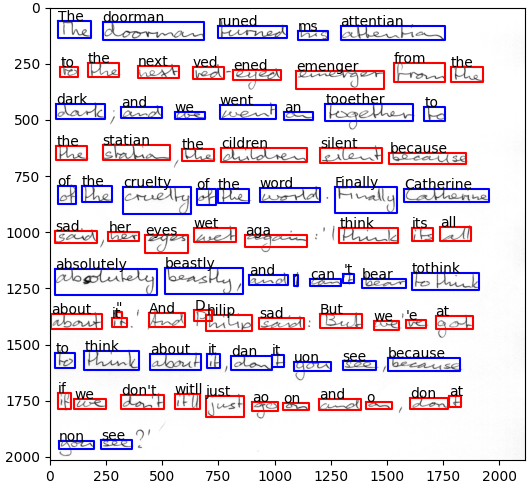

# Detect and Read Handwritten Words

Welcome to the handwritten text recognition (HTR) pipeline, where you can detect and read words in scanned pages with ease.

## Features:
# Word Detection:
    The pipeline employs a robust word detection algorithm that can accurately identify individual words in scanned pages, regardless of their orientation, size, or style of handwriting.

# Word Reading: 
    Once the words are detected, a sophisticated optical character recognition (OCR) engine is employed to convert the handwritten text into machine-readable format. This allows for seamless access, indexing, and further analysis of the textual content.

# Configurable Settings: 
    The pipeline provides flexibility through configurable settings. Users can fine-tune parameters such as the minimum word height, line clustering thresholds, and more, to adapt the system to their specific requirements.

# Demo Application: T
    he included demo application showcases the pipeline's capabilities by processing sample images and providing visual representations of the detected words. This allows users to quickly grasp the potential of the system.

## Overview

This pipeline utilizes advanced algorithms to perform two main operations:

1. **Word Detection:** The system effectively detects individual words in scanned pages, enabling precise analysis and extraction of text.

2. **Word Reading:** Once the words are detected, the pipeline employs sophisticated techniques to accurately read and interpret the handwritten text, enabling seamless access to the content.



## Installation

To get started, follow these simple installation steps:

1. Navigate to the root directory of the repository.
2. Execute the command `pip install .` to install the necessary dependencies.

## Usage

### Run the Demo

To get a glimpse of the pipeline's capabilities, run the provided demo:

1. Install `matplotlib` for plotting by executing `pip install matplotlib`.
2. Navigate to the `scripts/` directory.
3. Run the command `python demo.py`.
4. Sit back and marvel at the output, which should resemble the plot shown above.

### Use the Python Package

##Integrate the Pipeline
# Integrating the HTR pipeline into your own projects is straightforward:

Import the read_page function from the htr_pipeline module.
Read your image using OpenCV or any other image processing library.
Utilize read_page to detect and read the handwritten text, providing optional configuration parameters to fine-tune the detection process.
Access the extracted text by iterating over the returned data structure, which provides information about the detected words, their positions, and other relevant details.
Refer to the documentation and function signatures for additional information on available settings and customization options.

```python
import cv2
from htr_pipeline import read_page, DetectorConfig

# Read the image
img = cv2.imread('data/r06-137.png', cv2.IMREAD_GRAYSCALE)

# Detect and read text
read_lines = read_page(img, DetectorConfig(height=1000))

# Output the text
for read_line in read_lines:
    print(' '.join(read_word.text for read_word in read_line))
```

Feel free to explore further customization options by referring to the docstrings of `detect` and `sort_multiline` in `htr_pipeline/word_detector/__init__.py`. Notably, the `DetectorConfig` allows adjusting the text height, while the `LineClusteringConfig` offers control over line clustering parameters.

Discover the power of the HTR pipeline, where handwritten words come to life. Unleash the potential of your handwritten documents with ease and precision!

## Conclusion
The handwritten text recognition (HTR) pipeline offers an effective and efficient solution for detecting and reading words in scanned documents. By combining cutting-edge algorithms and deep learning models, it provides accurate results and flexibility for various use cases. Whether you need to digitize handwritten notes, process historical documents, or extract information from paper-based sources, this pipeline is a valuable tool to streamline your workflow and unlock the potential of handwritten text.
